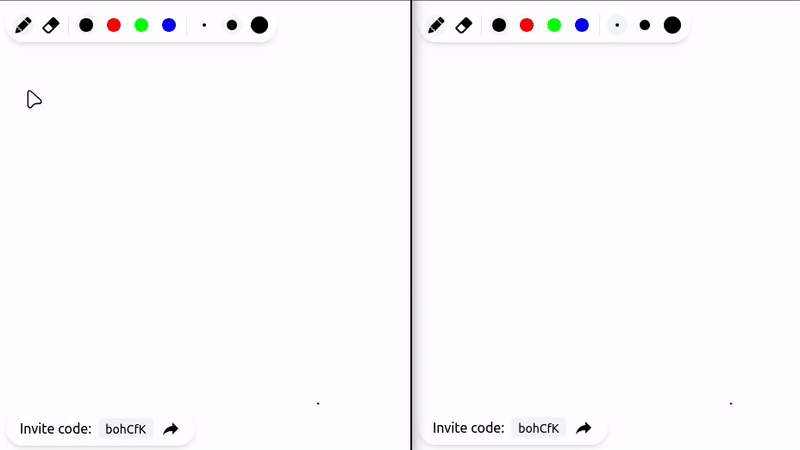

# Drawing Canvas App
A demo collaborative drawing canvas application built with Laravel and Vue 3.

> [!IMPORTANT] 
> This project was developed over the course of one week to demostrate
> proficiency with those technologies. It is not intended for production use.



## Highlights
- Real-time: Collaborative drawing canvas with real-time updates
- Performant: Strokes are stored as line segments
- Guest support: Users can draw without creating an account
- No Pusher required: Uses Soketi as alternative for local development

## Todos
- Document API endpoints.
- Add unit and end-to-end tests.
- In-memory database: store incoming strokes in memory and persist them to the database in batches.
- Canvas controls: Implement pan and zoom controls for an infinite canvas.
- Color picker: Allow users to select any color.
- Real-time cursors: Display live cursors of other users in the canvas.
- UX improvements: Enhance application pages with skeletons, error handling, page animations.
- API abuse prevention: Implement rate limiting and abuse detection.

## Requirements
- Docker

## Setup
1. Clone the repository
2. Install API dependencies
    ```bash
    docker compose run --rm api composer install
    ```
3. Install client dependencies
    ```bash
    docker compose run --rm client npm install
    ```
2. Set up environment files
    ```bash
    cp api/.env.example api/.env
    cp client/.env.example client/.env.local
    docker compose run --rm api php artisan key:generate
    ```
4. Start the services
    ```bash
    docker compose up -d
    ```
5. Run database migrations
    ```bash
    docker compose run --rm api php artisan migrate
    ```
6. Access the application at http://localhost:5173
